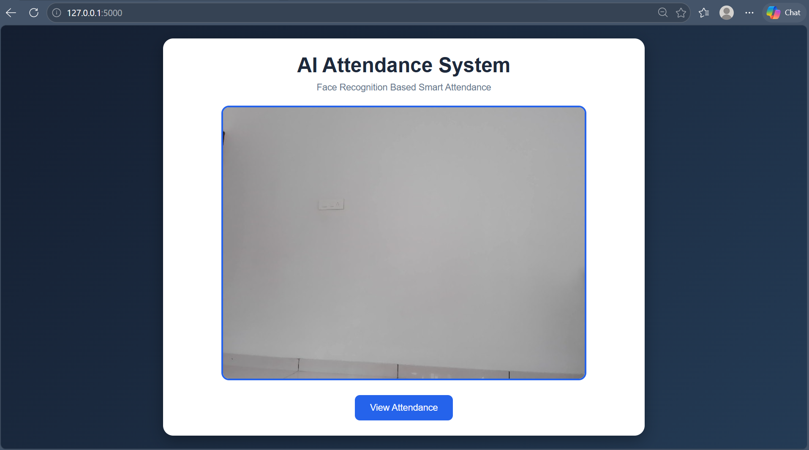
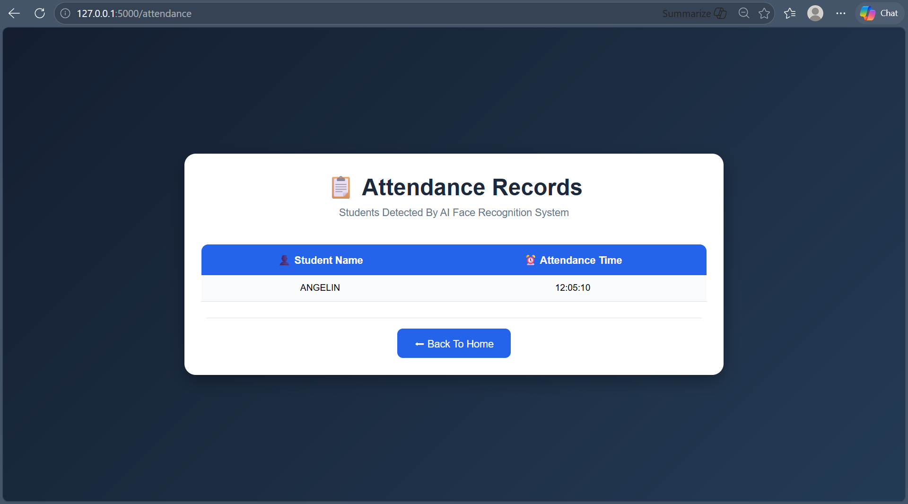

# 🤖 AI Attendance Web App

An AI-powered attendance management system built using Flask, OpenCV, and Face Recognition.

This web application detects faces through a live webcam feed and automatically marks attendance in real-time.

---

# 🚀 Features

✅ Real-time face detection  
✅ AI face recognition  
✅ Automatic attendance marking  
✅ Flask web application  
✅ Live webcam feed  
✅ Attendance dashboard  
✅ CSV attendance storage  
✅ Modern responsive UI  

---

# 🛠 Technologies Used

- Python
- Flask
- OpenCV
- face_recognition
- HTML
- CSS
- NumPy

---

# 📸 Screenshots

## 🏠 Home Page

---

## 😀 Face Detection

---

## 📋 Attendance Records

---

